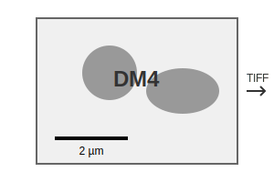

**ScaleBarDM4**

ScaleBarDM4 is a Fiji/ImageJ macro that automates the processing of DM4 image files. It enables the following features:

- Conversion of DM4 files to TIFF format
- Adjustment of contrast
- Scaling of images based on pixel size metadata
- Automatic addition of appropriate scale bars

| Image Size | Scale Bar Length |
|-------------------|-----------------|
| < 800 nm          | 100 nm         |
| 800 - 1600 nm     | 200 nm         |
| 1.6 - 3.5 µm      | 500 nm         |
| 3.5 - 6 µm        | 1 µm           |
| 6 - 20 µm         | 2 µm           |
| 20 - 44 µm        | 5 µm           |
| 44 - 80 µm        | 10 µm          |
| 80 - 210 µm       | 20 µm          |
| 210 - 350 µm      | 50 µm          |
| > 350 µm          | 100 µm         |

## Usage
1. Launch Fiji/ImageJ
2. Install the Macro
3. Select the folder containing your DM4 files
4. Processed images are saved in the "output_Tiff_scaleBar" subdirectory

